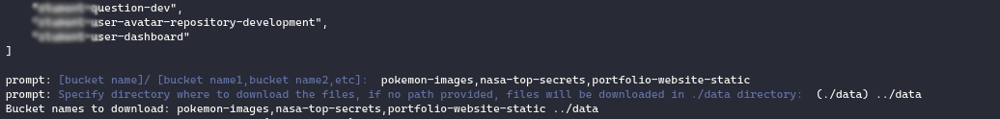
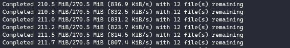

<h1 align="center">👋 Welcome to S3 Bucket Download (s3-bucket-downloader) 🕶</h1>
<h3 align="center">
  
  <a href="https://www.npmjs.com/package/s3-bucket-downloader" target="_blank">
    
  </a>
    
  
  <a href="https://github.com/MiKr13/S3-Bucket-Download/#README" target="_blank">
    
  </a>
  <a href="https://github.com/open-devs/s3-bucket-download/graphs/commit-activity" target="_blank">
    
  </a>
  <a href="#" target="_blank">
    
  </a>
  <a href="https://twitter.com/opendevs_2020" target="_blank">
    
  </a>
  <a href="https://github.com/open-devs" target="_blank">
    
  </a>
  
</h3>

This project enables downloading data from s3 a breeze, it has 3 modes _(CLI mode, Interactive mode & Download All mode)_ using which you can download _aws s3 bucket_ files into default or custom path.<br/>
If you choose the same directory as previous time, it'll `sync` those changes.

### 🏠 [Homepage](https://github.com/MiKr13/S3-Bucket-Download/#README)

<!--### ✨ [Demo](https://github.com/MiKr13/S3-Bucket-Download/#README) -->

## Install

```sh
npm install
```

## Usage

_Run anyone of following commands (only interactive mode available currently):_

```sh
s3
# or
s3-downloader
# or
s3-bucket-downloader
```

## Usage (advanced user)

### _Interactive mode:_

```sh
node download
```

> It'll display list of all buckets in an array & ask for options like:



### _CLI mode:_

```sh
node download --bucketName=[comma,seperated,bucketnames] --path=[path to save to for ex: ../data]
```

> Without brackets ofcourse.

### _Download All mode:_

```sh
node download --all
```

> Just downloads all of the files in all of the buckets.

## Logs:

>It shows logs too, like these:



## 🕺 Author

**open devs (open.devs.github@gmail.com)**

* website: https://opendevs.in/
* github: [@open-devs](https://github.com/open-devs)
* core members: [@mikr13](https://github.com/mikr13), [@alok722](https://github.com/alok722)

## 🤝 Contributing

Contributions, issues and feature requests are welcome!<br />Feel free to check [issues page](https://github.com/MiKr13/S3-Bucket-Download/issues).

## 🚀 future scope

1. Support for different AWS profiles & regions
2. Add a GUI on top of this (React + Electron planned)

## 🤝 contributing

contributions, issues and feature requests are welcome!<br />feel free to check [issues page](https://github.com/open-devs/s3-bucket-download/issues). you can also take a look at the [contributing guide](https://github.com/open-devs/s3-bucket-download/blob/master/CONTRIBUTING.md).

## 🙌 show your support

give a ⭐️ if this project helped you!

<a href="https://www.buymeacoffee.com/opendevs" target="_blank"></a>

## 📝 license

copyright © 2020 [open devs (open.devs.github@gmail.com)](https://github.com/open-devs).<br />
This project is [MIT](https://github.com/open-devs/s3-bucket-download/blob/master/LICENSE) licensed.

***
_this README was generated with ❤️ by [readme-md-generator](https://github.com/kefranabg/readme-md-generator)_
